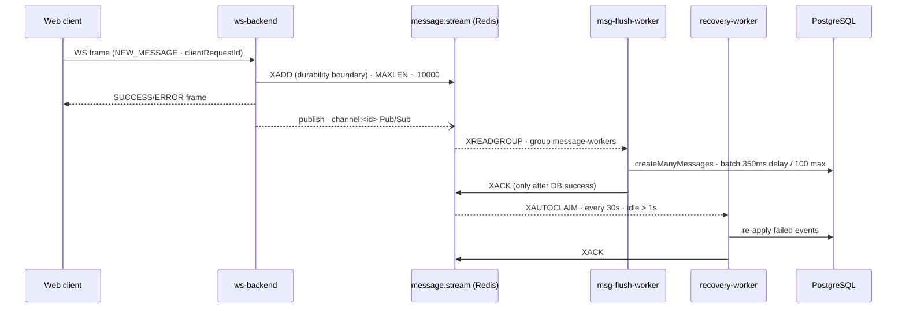
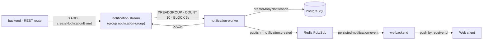

# Cluster

A real-time messaging / chat platform (a Discord- or Slack-style app) built as a **Bun + Turborepo monorepo**.

## Features

- Create / join **networks** (servers) each with **channels** (text rooms)
- Send, edit, and delete **messages** in real time with optimistic UI updates
- Manage network membership with a role hierarchy (`OWNER > ADMIN > MODERATOR > MEMBER`)
- Add **friends** and send **friend requests** (request → accept / block, DM-style messaging over `friendshipId`)
- Create **invite links** for networks (limited use, expiring, revocable)
- Receive **notifications** (friend requests, mentions, reactions) in real time
- Sign in via **Google OAuth** or **email magic link** (better-auth + Resend)
- Upload avatars via **S3 presigned URLs** served through CloudFront

## Tech stack

### Tooling

| Tool                              | Version                                                              |
| --------------------------------- | -------------------------------------------------------------------- |
| Bun (package manager, `bun.lock`) | `1.3.6` (Node `>=20`)                                                |
| Turborepo                         | `2.9.14`                                                             |
| TypeScript                        | `5.9.3`                                                              |
| ESLint                            | `^9.39.2` (root & web; backend/ws-backend/workers resolve ESLint 10) |
| Prettier                          | `^3.8.1` + `prettier-plugin-tailwindcss` `^0.7.2`                    |
| husky / lint-staged               | `^9.1.7` / `^16.4.0`                                                 |

### Apps

| App                                | Purpose                                        | Stack (declared)                                                                                                                                                                                                                                                                                                                                                                                           | Port |
| ---------------------------------- | ---------------------------------------------- | ---------------------------------------------------------------------------------------------------------------------------------------------------------------------------------------------------------------------------------------------------------------------------------------------------------------------------------------------------------------------------------------------------------- | ---- |
| `apps/web`                         | Next.js frontend                               | **next** `16.1.6`, **react** / **react-dom** `^19.2.4`, **@tanstack/react-query** `^5.100.14`, **@tanstack/react-form** `^1.32.0`, **axios** `^1.17.0`, **better-auth** `^1.6.9`, **react-use-websocket** `^4.13.0`, **motion** `^12.39.0`, **sonner** `^2.0.7`, **next-themes** `^0.4.6`, **react-easy-crop** `^6.2.3`, **@phosphor-icons/react** `^2.1.10`, **lucide-react** `^1.11.0`, **zod** `^4.4.3` | 3000 |
| `apps/backend`                     | Express REST API                               | **express** `^5.2.1`, **cors** `^2.8.6`, **zod** `^4.3.6`                                                                                                                                                                                                                                                                                                                                                  | 4000 |
| `apps/ws-backend`                  | WebSocket server                               | **ws** `^8.20.0`, **zod** `^4.4.3`                                                                                                                                                                                                                                                                                                                                                                         | 8080 |
| `apps/workers/msg-flush-worker`    | Redis Stream → Postgres persister + recovery   | only `@workspace/redis`, `@workspace/core`                                                                                                                                                                                                                                                                                                                                                                 | —    |
| `apps/workers/notification-worker` | Redis Stream → Postgres notification persister | **zod** `^4.4.3` + workspace packages                                                                                                                                                                                                                                                                                                                                                                      | —    |

### Packages

| Package                        | Purpose                                                                                                   | Stack (declared)                                                                                                                                                                                                                                                     |
| ------------------------------ | --------------------------------------------------------------------------------------------------------- | -------------------------------------------------------------------------------------------------------------------------------------------------------------------------------------------------------------------------------------------------------------------- |
| `@workspace/core`              | Shared domain services (messages, networks, channels, friends, invites, notifications, s3) + error system | —                                                                                                                                                                                                                                                                    |
| `@workspace/db`                | Prisma client + schema + migrations + seed                                                                | **prisma** `^7.8.0`, **@prisma/client** `^7.8.0`, **@prisma/adapter-pg** `^7.8.0`, **pg** `^8.20.0`, **dotenv** `^17.4.2`; uses the `PrismaPg` driver adapter                                                                                                        |
| `@workspace/redis`             | Redis client / publisher / subscriber singletons                                                          | **redis** (node-redis) `^5.12.1`                                                                                                                                                                                                                                     |
| `@workspace/auth`              | better-auth config (Google + magic link), session helpers                                                 | **better-auth** `^1.6.9`, **resend** `^6.12.3`                                                                                                                                                                                                                       |
| `@workspace/aws`               | S3 client wrapper                                                                                         | **@aws-sdk/client-s3** `^3.1068.0`, **@aws-sdk/s3-request-presigner** `^3.1068.0`                                                                                                                                                                                    |
| `@workspace/ui`                | Shared shadcn/ui components, Tailwind v4 globals                                                          | **tailwindcss** `^4.1.18`, **radix-ui** `^1.4.3`, **shadcn** `^4.5.0`, **class-variance-authority** `^0.7.1`, **clsx** `^2.1.1`, **tailwind-merge** `^3.5.0`, **tw-animate-css** `^1.4.0`, **sonner** `^2.0.7`, **zod** `^3.25.76` (note: zod v3 here, v4 elsewhere) |
| `@workspace/eslint-config`     | Shared flat ESLint configs (`base`, `next-js`, `react-internal`)                                          | —                                                                                                                                                                                                                                                                    |
| `@workspace/typescript-config` | Shared tsconfigs (`base`, `nextjs`, `react-library`)                                                      | —                                                                                                                                                                                                                                                                    |

### Infrastructure

- **PostgreSQL** — source of truth; Prisma (driver adapter) ORM
- **Redis** — Redis Streams (durability + worker queues) and Pub/Sub (realtime broadcast)
- **AWS S3 + CloudFront** — avatar uploads via presigned URLs
- **Resend** — transactional email for magic links

## Architecture

### Monorepo layout

```
cluster/
├── apps/
│   ├── backend/                 → Express REST API (port 4000); routes in apps/backend/routes/*, mounted by main.ts
│   ├── ws-backend/              → WebSocket server (port 8080)
│   ├── web/                     → Next.js 16 frontend (port 3000)
│   └── workers/
│       ├── msg-flush-worker/    → Redis Stream → Postgres persister + recovery worker
│       └── notification-worker/ → Redis Stream → Postgres notification persister
└── packages/
    ├── core/                    → shared domain services + error system (`export ./errors` and `./services/*`)
    ├── db/                      → Prisma client + schema + migrations + seed (generated client in packages/db/generated/prisma)
    ├── redis/                   → redisClient / publisher / subscriber singletons
    ├── auth/                    → better-auth config + session helpers
    ├── aws/                     → S3 client wrapper
    ├── ui/                      → shadcn/ui components, Tailwind v4 globals
    ├── eslint-config/           → shared flat ESLint configs
    └── typescript-config/       → shared tsconfigs
```

Workspace packages are consumed straight from `src/index.ts` (no build step; Bun/Next transpiles them). Builders differ per app: `notification-worker` builds with `tsc`; WS and msg-flush workers build with Bun's bundler.

### System overview

```mermaid
flowchart TB
    subgraph Client
        Web["apps/web · Next.js 16 (port 3000)"]
        UI["React Query cache · optimistic UI"]
    end

    subgraph APITier[""]
        Backend["apps/backend · Express (port 4000)"]
        WS["apps/ws-backend · WebSocket (port 8080)"]
    end

    subgraph Redis["Redis"]
        Streams["Streams<br/>message:stream · notification:stream"]
        PubSub["Pub/Sub<br/>channel:<id> · notification.created"]
    end

    subgraph Workers[""]
        Flush["msg-flush-worker"]
        Recovery["recovery-worker"]
        Notif["notification-worker"]
    end

    Postgres["PostgreSQL · Prisma"]

    Web -->|REST · axios · better-auth| Backend
    Web -->|WS frames · react-use-websocket| WS
    Web --- UI
    Backend -->|XADD · createNotificationEvent| Streams
    WS -->|XADD · messages-services| Streams
    WS -->|publish| PubSub
    PubSub -->|subscriber bridge · fan-out| WS
    Streams -->|XREADGROUP| Flush
    Streams -->|XREADGROUP| Notif
    Streams -->|XAUTOCLAIM · PEL| Recovery
    Flush -->|createManyMessages · XACK| Postgres
    Recovery -->|re-apply · XACK| Postgres
    Notif -->|createManyNotification · XACK| Postgres
```

<details>
<summary>ASCII fallback</summary>

```text
                  ┌────────────────────────────────────────────┐
                  │   apps/web · Next.js 16 (port 3000)        │
                  │   React Query cache · optimistic UI        │
                  └──────┬──────────────┬──────────────────────┘
                         │              │ WebSocket frames
                 REST/axios             │ (react-use-websocket)
                         │              ▼
                  ┌──────▼──────────────────────────────────────┐
                  │ apps/backend                          ws-backend │
                  │ Express (4000)                        ws (8080)  │
                  └──────┬───────────────┬──────────────┬───────────┘
                         │ XADD          │ publish      │ XADD
                         ▼               ▼              ▼
                 ┌───────────────────────────────────────────────┐
                 │                     Redis                      │
                 │  Streams: message:stream · notification:stream │
                 │  Pub/Sub: channel:<id> · notification.created  │
                 └──────┬────────────────────┬────────────────────┘
                        │ XREADGROUP         │ XAUTOCLAIM (PEL)
                        ▼                    ▼
      ┌─────────────────┬────────────────────┐───────────────────┐
      │ msg-flush-worker│ recovery-worker    │ notification-worker│
      └─────────────────┴────────────────────┘───────────────────┘
                        │
                        ▼
                 PostgreSQL · Prisma
```

</details>

### Message delivery (realtime)



<details>
<summary>ASCII fallback</summary>

```text
  Web client           ws-backend            message:stream (Redis)         PostgreSQL
     │                     │                        │                           │
     │  NEW_MESSAGE        │                        │                           │
     ├────────────────────►│                        │                           │
     │  clientRequestId    │                        │                           │
     │                     │  XADD  (durability     │                           │
     │                     ├───────────────────────►│                           │
     │                     │  boundary)             │                           │
     │  SUCCESS / ERROR    │                        │                           │
     │◄────────────────────┤                        │                           │
     │                     │                        │                           │
     │                     │  publish: channel:<id> │ ──► fan-out to sockets    │
     │                     ├───────────────────────►│                           │
     │                     │                        │                           │
     │                     │                        │  XREADGROUP (group       │
     │                     │                        │  message-workers)         │
     │                     │                        ├─────────────────────────►│
     │                     │                        │  createManyMessages       │
     │                     │                        │  (batch 350ms / 100)     │
     │                     │                        │                           │
     │                     │                        │◄─────────────────────────┤
     │                     │                        │  XACK (after DB success)  │
     │                     │                        │                           │
     │                     │                        │  XAUTOCLAIM (30s, >1s)    │
     │                     │                        ├─────────────────────────►│
     │                     │                        │  re-apply / XACK          │
```

</details>

- `XADD` is the **durability boundary** — after a successful append, the system is responsible for preserving and processing the message.
- The UI is updated **optimistically** (prepending into the react-query cache); a `SUCCESS`/`ERROR` frame references the sender's `clientRequestId`.
- `EDIT`/`DELETE` are applied immediately and ACKed; `NEW_MESSAGE` events are batched (flush after **350ms** or **100** messages).
- Failed events stay **un-ACKed in the PEL**; **recovery-worker** reprocesses them → exactly-once-ish persistence.

### Notification delivery



<details>
<summary>ASCII fallback</summary>

```text
  backend REST route ──XADD──► notification:stream ──XREADGROUP──► notification-worker
                                    ▲ (group notification-group)         │
                                    │                                   │ createManyNotification
                                    │                                   ▼
                                    │   XACK (after DB success)   PostgreSQL
                                    │
                                    └───── publish: notification.created ─────► Redis Pub/Sub
                                                                                 │ persisted-notification-event
                                                                                 ▼
                                                                            ws-backend
                                                                                 │ push by receiverId
                                                                                 ▼
                                                                           Web client
```

</details>

### Data model

PostgreSQL schema in `packages/db/prisma/schema.prisma` (26 migrations, April 2026 → August 2026):

- **Auth**: `User` (unique auto-generated `username`), `Session`, `Account`, `Verification`
- **Network** (PUBLIC/PRIVATE) → **NetworkMembers** (role enum `OWNER`/`ADMIN`/`MODERATOR`/`MEMBER`) → **Channel** (unique per network + name) → **Message** (indexes on `[channelId, createdAt DESC]` and `[friendshipId, createdAt DESC]`)
- **Friendship** (sender/receiver, status `PENDING`/`ACCEPTED`/`BLOCKED`, unique pair); a message targets `channelId` _or_ `friendshipId`
- **Invite** (token, maxUses/currentUses, expiresAt, revoked, role)
- **Notification** (type `FRIEND_REQUEST`/`MENTION`/`REACTION`, actor/user, optional entity + JSON `data`, unique `[actorId, userId]`, index `[userId, createdAt DESC]`)

### REST API surface (`apps/backend/routes/`)

`GET /health` and all `/api/auth/*` (better-auth). Auth-gated (except invite preview): `/api/me`, `/api/networks` (+ `/:id`, `/search`, member search/roles/removal), `/api/channels/:channelId/messages`, `/api/friendship/:friendshipId/messages`, `/api/friendship` (+ `/add/:friendId`), `/api/invites` (+ `/:token`, plus public `GET /api/invites/:token` preview), `/api/generate-presigned-url`, `/api/notifications`, `/api/user/search`.

## Key conventions

- **Error handling**: `AppError` base class (`code`, `statusCode`, `status` `"fail"|"error"`, `suggestion`); concrete `BadRequestError`, `ValidationError`, `UnauthorizedError`, `NotFoundError`, `ForbiddenError`, `ResourceExpiredError`. `normalizeError()` maps Prisma (`P2002`, `P2003`, `P2011`, `P2025`, init/validation/rust-panic) and S3 errors into `AppError`. `sendErrorResponse()` returns a uniform shape: `{ success, status, statusCode, error: { code, message, timestamp, path, suggestion }, requestId }`.
- **Validation**: every request/response payload is validated with **zod**; schemas centralized in `apps/backend/lib/zod.schemas.ts` and `apps/ws-backend/src/zod.schemas.ts` (zod v4). ID params validated with `z.uuid()`.
- **Auth**: better-auth in `packages/auth` — Prisma adapter, Google OAuth + magic-link plugin (Resend, 5-min expiry), auto-generated unique `@username`, 7-day sessions. Express middleware and WS upgrade both use `getSessionFromHeaders`; `req.user` augmented via module declaration.
- **Frontend**: never make a page itself a client component; use **react-query** for data fetching and **zustand** for global state; use **shadcn**, **tanstack forms**, and **zod**. Infinite message pagination via `useInfiniteQuery` (50/page) + `IntersectionObserver`. Realtime handled by `ChatSection` with `react-use-websocket`; `lastJsonMessage` switch directly mutates the react-query cache and `ERROR` frames surface a sonner toast.
- **Styling**: Tailwind v4 via `@tailwindcss/postcss`; CSS variables from `packages/ui/src/styles/globals.css`; shadcn `radix-nova` style aliased into `@workspace/ui`.
- **Docker**: multi-stage `FROM oven/bun:alpine` images using `bunx turbo prune <app> --docker`. Web uses Next standalone output. msg-flush-worker Dockerfile produces both `worker-runner` and `recovery-runner`.

## Getting started

### Prerequisites

- Bun `1.3.x` (Node `>=20`)
- A running PostgreSQL instance and Redis instance

### Install

```bash
bun install
```

### Environment variables

Per-workspace `.env` files (committed):

- Common: `DATABASE_URL`, `REDIS_URL`, `NODE_ENV`, `BETTER_AUTH_SECRET`, `BETTER_AUTH_URL`
- Auth: `GOOGLE_CLIENT_ID`, `GOOGLE_CLIENT_SECRET`, `RESEND_API_KEY`
- Storage: `S3_BUCKET_NAME`, `CLOUDFRONT_URL`
- Also declared in `turbo.json` `globalEnv`

### Commands

All root commands go through Turbo:

```bash
bun install             # install deps
bun run dev             # turbo dev (web, backend, ws-backend persistent)
bun run build           # turbo build
bun run lint            # turbo lint
bun run format          # turbo format
bun run typecheck       # turbo typecheck (tsc --noEmit)
bun run worker:build    # msg-flush-worker → dist/worker.js (bun build --target node)
bun run recovery:build  # msg-flush-worker → dist/recovery-worker.js
```

Per-app dev / build:

```bash
# backend (port 4000)
AWS_PROFILE=cluster-s3-dev bun --bun --watch src/index.ts

# ws-backend (port 8080)
bun --watch src/index.ts

# web (port 3000)
next dev --turbopack

# msg-flush-worker
bun run --watch src/worker.ts            # dev
bun run --watch src/recovery-worker.ts   # recovery dev

# notification-worker
bun src/worker.ts   # dev
```

Database (`packages/db`):

```bash
bunx --bun prisma generate
bunx --bun prisma migrate dev
bunx --bun prisma migrate deploy
bun --env-file=.env --bun prisma db seed   # seeds a "Cluster" network with welcome channels/messages
```

## Testing & quality gates

There are **no automated tests** in the repo yet. Quality gates are static only:

- `eslint` per app (root eslint config also uses `eslint-plugin-only-warn`)
- `tsc --noEmit` via `bun run typecheck` / per-app `check-types`
- **husky pre-commit** hook → `bunx lint-staged` → `prettier --write` + `eslint --fix` on staged JS/TS, prettier on json/md/css
